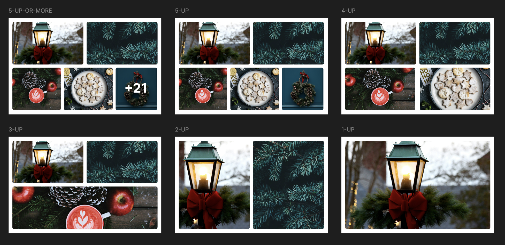

[](https://stackblitz.com/github/AdventOfCSS/2024-12-01__photo-gallery)
[](https://codesandbox.io/p/sandbox/github/AdventOfCSS/2024-12-01__photo-gallery)
[](https://codespaces.new/AdventOfCSS/2024-12-01__photo-gallery)

# Advent of CSS 2024 - Challenge #1

This is the solution for [Advent of CSS 2024](https://adventofcss.com) - Challenge #1.


## The Challenge

For today’s challenge, we’ll build a photo gallery card, similar to Facebook:

### Brief

Create a photo gallery card, similar to what Facebook uses in their feed. The “trick” here is not just to display the grid, but make the code “smart” enough to display the photos correctly, regardless of whether there’s 1 photo or 21.



## The Solution

I did a [live stream of me coding this out.](https://youtu.be/UfxfvsgVnVM) (Jump to the 11:33 mark. The first 11 minutes is me trying to work with CodePen and vanilla CSS. 😓)

For the solution, I used [Astro](https://astro.build/) and [TailwindCSS](https://tailwindcss.com/). Of course, these aren't requirements. But, these tools make it easy to get up and running quickly.

Inside of your Astro project, you'll see the following folders and files:

```text
/
├── public/
├── src/
│   └── pages/
│       └── index.astro
└── package.json
```

All of the HTML in inside the `index.astro` file.

The static assets, like images, are inside the `public/images/` directory.

## 🧞 Commands

All commands are run from the root of the project, from a terminal:

| Command                   | Action                                           |
| :------------------------ | :----------------------------------------------- |
| `npm install`             | Installs dependencies                            |
| `npm run dev`             | Starts local dev server at `localhost:4321`      |
| `npm run build`           | Build your production site to `./dist/`          |
| `npm run preview`         | Preview your build locally, before deploying     |
| `npm run astro ...`       | Run CLI commands like `astro add`, `astro check` |
| `npm run astro -- --help` | Get help using the Astro CLI                     |
